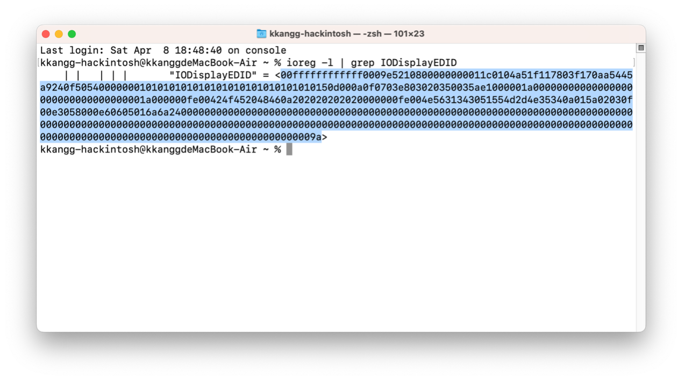
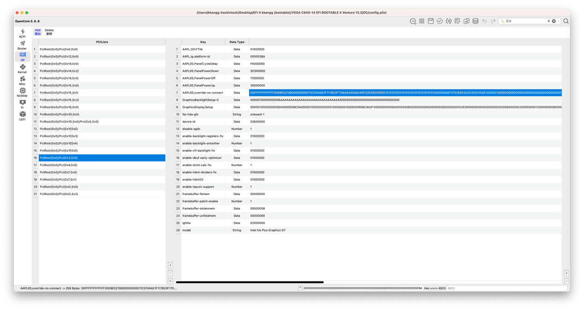

This EFI contains complete drivers and patches. Due to the special characteristics of the C940-14 4K version, this EFI configuration can only be used **after completing the setup assistant and successfully entering the system**.

Using it directly to boot the installation process may cause display anomalies or screen glitches.

This EFI configuration injects EDID information into the GPU device properties at the DP node.  
If your device screen is not 4K or is a different model, display anomalies or glitches may also occur.

If you encounter display issues, you can try deleting the `AAPL00,override-no-connect` field.

---

You can get your device’s EDID information by running the following command in Terminal:

```bash
ioreg -l | grep IODisplayEDID
```



---

Use **OCAuxiliaryTools** to open the `config.plist` file for editing.  
Navigate to the DP section — find the PCI device at:

`PciRoot(0x0)/Pci(0x2,0x0)`

Change the information in the `AAPL00,override-no-connect` field to your own EDID.


